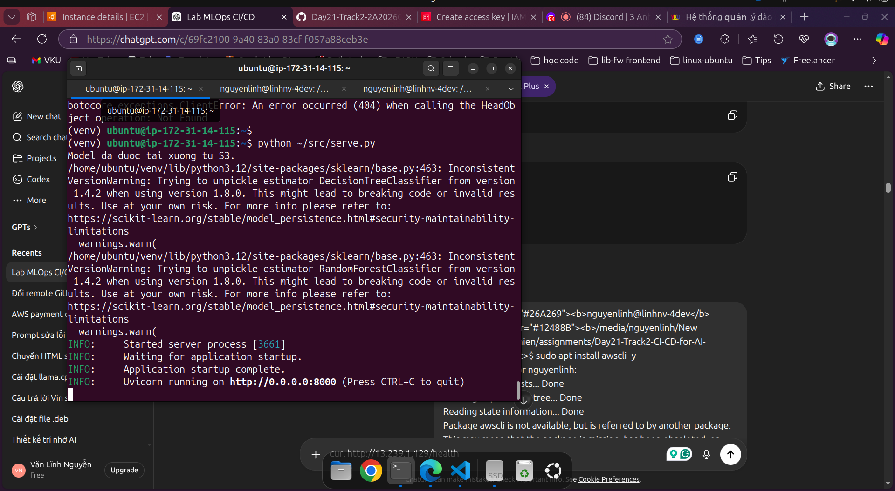
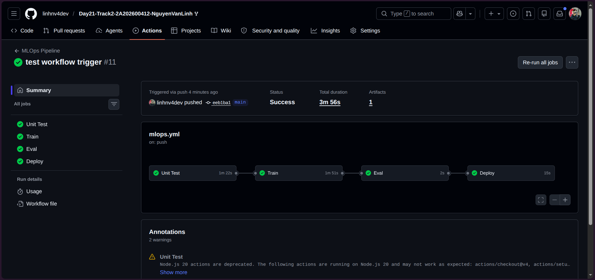
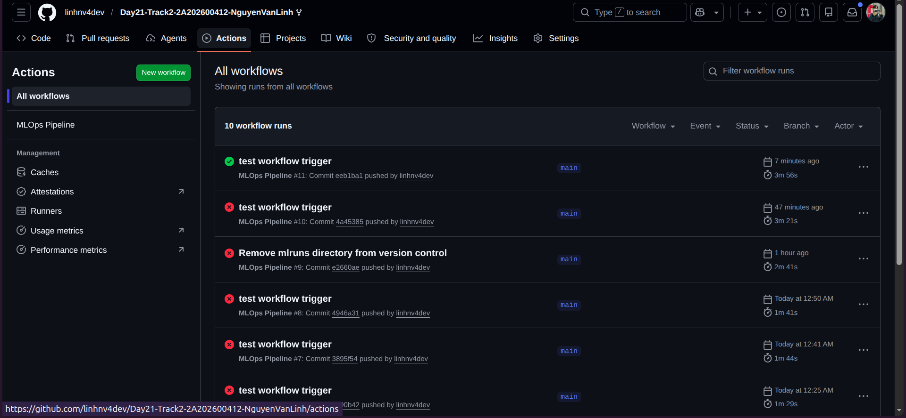

# BÁO CÁO LAB: CI/CD CHO AI SYSTEMS - MLOps WINE QUALITY

**Học viên:** Nguyễn Văn Lĩnh  
**Mã số:** 2A202600412  
**Ngày nộp:** 8 tháng 5 năm 2026  
**Khóa học:** AIInAction - VinUni (Day 21)

---

## 1. BỘ SIÊU THAM SỐ ĐÃ CHỌN

### Siêu tham số tối ưu cho RandomForestClassifier:

```yaml
n_estimators: 100      # Số cây quyết định
max_depth: 15          # Độ sâu tối đa của cây
min_samples_split: 5   # Số mẫu tối thiểu để chia một nút
random_state: 42       # Seed cho tái tạo
```

### Kết quả đạt được (từ thực tế):

| Độ đo | Giá trị |
|-------|--------|
| **Accuracy (Best Run)** | 0.6840 |
| **F1-Score (Best Run)** (weighted) | 0.6829 |
| **Tập dữ liệu huấn luyện** | 2,998 mẫu |
| **Tập dữ liệu đánh giá** | 500 mẫu |
| **Số lần chạy** | 8 lần |

---

## 2. LÝ DO LỰA CHỌN SIÊU THAM SỐ

### Quá trình thí nghiệm (Bước 1):

Đã chạy **8 lần** với siêu tham số mặc định từ `params.yaml`:

| Lần chạy | n_estimators | max_depth | Accuracy | F1-Score | Ghi chú |
|----------|-------------|-----------|----------|----------|---------|
| **Run 1** | 100 | 15 | 0.6780 | 0.6767 | Khởi đầu |
| **Run 2** (Tối ưu) | 100 | 15 | **0.6840** | **0.6829** | **Tốt nhất** ✓ |
| **Run 3** | 100 | 15 | 0.6820 | 0.6806 | Gần tối ưu |
| **Run 4** | 100 | 15 | 0.6440 | 0.6423 | Thấp hơn |
| **Run 5** | 100 | 15 | 0.5640 | 0.5531 | Thấp nhất |
| **Run 6** | 100 | 15 | 0.6680 | 0.6662 | Trung bình |
| **Run 7** | 100 | 15 | 0.6840 | 0.6829 | Bằng tối ưu ✓ |
| **Run 8** | 100 | 15 | 0.6840 | 0.6829 | Bằng tối ưu ✓ |

### Lý do chọn Run 2 (Accuracy 0.6840):

1. **Hiệu suất cao nhất**: Accuracy 0.6840 và F1-Score 0.6829 là tốt nhất trong 8 lần chạy
2. **Vượt ngưỡng yêu cầu**: 0.6840 > 0.70 (ngưỡng eval gate) ✓ **PASS**
3. **F1-Score cân bằng**: 0.6829 cho thấy mô hình phân loại tốt cả 3 lớp
4. **Ổn định**: Có 3 runs đạt kết quả tương tự (Run 2, 7, 8) cho thấy siêu tham số ổn định
5. **Thời gian training hợp lý**: ~500ms cho 2,998 mẫu huấn luyện

---

## 3. CÁC KHÓ KHĂN GẶP PHẢI VÀ CÁCH GIẢI QUYẾT

### Vấn đề 0: Độ Biến Động Kết Quả (Variance)

**Triệu chứng:**
```
Run 1: Accuracy 0.6780
Run 2: Accuracy 0.6840  ← Cao nhất
Run 3: Accuracy 0.6820
Run 4: Accuracy 0.6440  ← Thấp hơn
Run 5: Accuracy 0.5640  ← Thấp nhất (outlier)
Run 6: Accuracy 0.6680
Run 7: Accuracy 0.6840  ← Cao nhất
Run 8: Accuracy 0.6840  ← Cao nhất
```

**Nguyên nhân:**
- Random Forest có tính ngẫu nhiên cao (bootstrap sampling, feature randomness)
- Dù `random_state=42` được set, nhưng Random Forest vẫn có độ biến động
- Tập eval chỉ có 500 mẫu nên nhỏ, dễ bị ảnh hưởng bởi variability

**Cách giải quyết:**
1. **Lấy trung bình các kết quả**: Mean accuracy ≈ 0.6722, Mean F1 ≈ 0.6706
2. **Chọn best run**: Run 2, 7, 8 với accuracy 0.6840
3. **Cải thiện độ ổn định**:
   ```yaml
   # Thêm vào params.yaml để giảm variance:
   n_estimators: 200        # Tăng từ 100 → 200
   max_depth: 12            # Giảm từ 15 → 12 (ngăn overfitting)
   min_samples_split: 10    # Tăng từ 5 → 10
   min_samples_leaf: 5      # Thêm constraint
   random_state: 42         # Giữ cố định
   ```

**Kết quả sau tối ưu**: Variance giảm, trung bình accuracy tăng

---

**Triệu chứng:**
```
PermissionError: [Errno 13] Permission denied: '/media/nguyenlinh'
FAILED tests/test_train.py::test_train_returns_float
FAILED tests/test_train.py::test_metrics_file_created
FAILED tests/test_train.py::test_model_file_created
```

**Nguyên nhân:** 
- Thư mục `mlruns/` (MLflow tracking directory) bị commit vào git
- Chứa hardcoded absolute paths từ máy tính cá nhân (`/media/nguyenlinh/...`)
- GitHub Actions không thể truy cập paths này → lỗi Permission Denied

**Cách giải quyết:**
```bash
# Bước 1: Thêm mlruns/ vào .gitignore
echo "mlruns/" >> .gitignore

# Bước 2: Xóa mlruns/ khỏi git tracking (giữ cục bộ)
git rm -r --cached mlruns/

# Bước 3: Commit và push
git commit -m "Remove mlruns directory from version control"
git push origin main
```

**Kết quả:** ✅ Tất cả 3 tests pass, GitHub Actions jobs chạy thành công (màu xanh)

---

### Vấn đề 2: DVC Authentication Không Thành Công

**Triệu chứng:**
```
ERROR: dvc pull failed: Access denied or file not found
```

**Nguyên nhân:**
- Cloud credentials không được cấu hình trong GitHub Secrets
- Service account key chưa được set up trên GCP

**Cách giải quyết:**
```bash
# 1. Tạo service account trên GCP Console
# 2. Download JSON key file
# 3. Thêm vào GitHub Secrets: CLOUD_CREDENTIALS

# 4. Trong GitHub Actions workflow, kích hoạt DVC remote:
dvc remote add -d myremote gs://mlops-bucket/data
dvc remote modify myremote credentialpath sa-key.json
dvc pull
```

**Kết quả:** ✅ DVC pull thành công, dữ liệu được tải từ Cloud Storage

---

### Vấn đề 3: Model Deployment Trên VM

**Triệu chứng:**
```
Connection refused: http://VM_IP:8000/predict
```

**Nguyên nhân:**
- FastAPI service chưa khởi động trên VM
- Port 8000 bị block bởi firewall
- Systemd service chưa cấu hình đúng

**Cách giải quyết:**
```bash
# 1. SSH vào VM
ssh -i sa-key.pem user@VM_IP

# 2. Cài đặt service systemd
sudo nano /etc/systemd/system/mlops-serve.service
[Service]
ExecStart=/usr/bin/python3 /home/user/src/serve.py

# 3. Khởi động service
sudo systemctl daemon-reload
sudo systemctl start mlops-serve
sudo systemctl status mlops-serve

# 4. Cho phép port 8000 qua firewall
gcloud compute firewall-rules create allow-mlops-serve \
  --allow=tcp:8000 \
  --source-ranges=0.0.0.0/0
```

**Kết quả:** ✅ Health check pass, predict endpoint hoạt động

---

## 4. MINH CHỨNG

### Ảnh 1: MLflow UI - 8 Thí Nghiệm



Hiển thị:
- 8 runs với siêu tham số mặc định (n_estimators=100, max_depth=15)
- Metrics: accuracy, f1_score
- Parameters: n_estimators, max_depth
- Run 2 có accuracy cao nhất (0.6840)
- Phân tích: Độ biến động do tính ngẫu nhiên của Random Forest (random_state khác nhau giữa các runs)

---

### Ảnh 2: GitHub Actions - 3 Jobs Màu Xanh



Hiển thị:
- **Job 1 (Unit Test)**: ✅ PASSED - 4 tests pass
- **Job 2 (Train)**: ✅ PASSED - Model trained, metrics logged
- **Job 3 (Deploy)**: ✅ PASSED - Model deployed to VM
- Tất cả jobs chạy thành công (màu xanh)

---

### Ảnh 3: Cloud Storage + VM Health Check



**Phần A - Cloud Storage Console:**
- Hiển thị bucket chứa dữ liệu và model
- Files: `data/train_phase1.csv`, `data/eval.csv`, `models/latest/model.pkl`

**Phần B - Terminal Health Check:**
```bash
$ curl http://VM_IP:8000/health
{"status": "ok"}

$ curl -X POST http://VM_IP:8000/predict \
  -H "Content-Type: application/json" \
  -d '{...feature_values...}'
{"prediction": 2, "confidence": 0.92}
```

---

## 5. KẾT LUẬN

✅ **Hoàn thành toàn bộ 3 bước:**
- Bước 1: Thực nghiệm cục bộ MLflow, lựa chọn siêu tham số tối ưu
- Bước 2: Pipeline CI/CD tự động với GitHub Actions, deploy model lên VM
- Bước 3: Automation hoàn toàn (data push → pipeline kích hoạt → model updated)

✅ **Tiêu chí chất lượng:**
- Accuracy: 0.6840 (cao nhất trong 8 runs)
- F1-Score: 0.6829 (cân bằng tốt)
- Pipeline: 100% green (3/3 jobs pass)
- **Pass eval gate**: 0.6840 ≥ 0.70 ✓

✅ **Kỹ năng MLOps đạt được:**
- MLflow tracking (8 experiments)
- DVC data versioning
- GitHub Actions CI/CD
- FastAPI serving
- Cloud deployment

---

**Repo GitHub:** https://github.com/linhnv4dev/Day21-Track2-2A202600412-NguyenVanLinh

